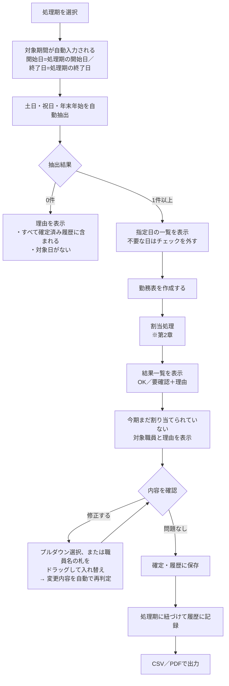
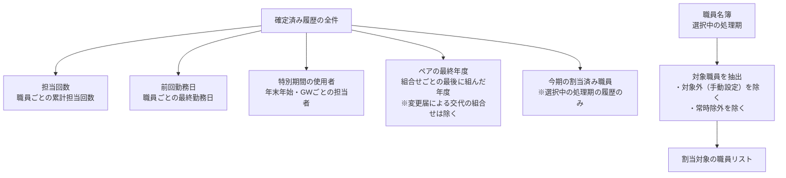
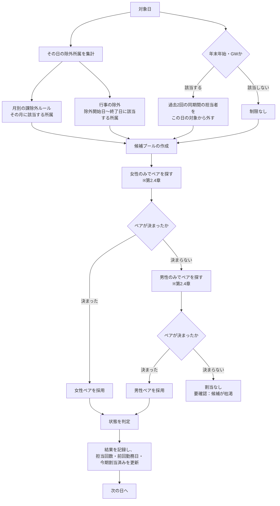
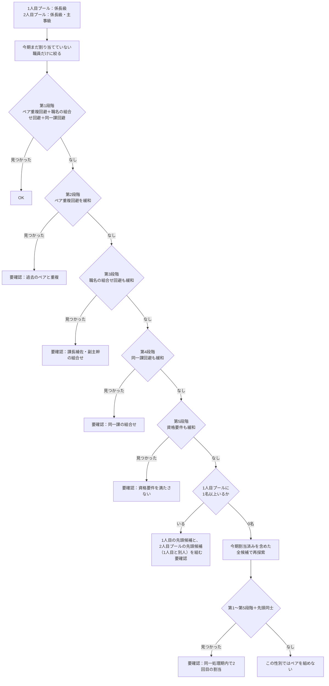

# 勤務表作成フロー

本書は、勤務表作成タブで「勤務表を作成する」を押したときの処理の流れを、実装に即して記載したものです。ルールの内容が実際の運用と合っているかの確認にご使用ください。

| 項目 | 内容 |
| --- | --- |
| 版数 | 1.1 |
| 作成日 | 2026-08-19 |
| 対象 | 勤務表作成タブ（`generateAssignments`） |
| 関連文書 | 仕様書（`docs/仕様書.md`）、設計書（`docs/設計書.md`） |

---

## 1. 全体フロー（画面操作）



**指定日の抽出条件**

| 種別 | 条件 |
| --- | --- |
| 土曜・日曜 | 曜日による判定 |
| 祝日 | 計算式による自動判定（春分・秋分は近似式、ハッピーマンデー・振替休日・国民の休日を含む） |
| 年末年始閉庁日 | 12/28〜1/3（曜日を問わない） |
| 除外 | 既に確定済み履歴に存在する日付は抽出しない |

---

## 2. 割当処理のフロー

### 2.1 前処理（1回だけ実行）

確定済み履歴の全件から、判定に使う情報を集計します。



**常時除外の判定（この時点で対象から外れる）**

| No | 条件 |
| --- | --- |
| 1 | 名簿の「派遣（除外）」がオン |
| 2 | 名簿の「7割措置（除外）」がオン |
| 3 | 係名または所属名に「秘書係」を含む |
| 4 | 兼職欄に「運転手」を含む |
| 5 | 所属名が、処理期の「常時除外する所属」のいずれかを含む |
| 6 | 名簿の「対象に含める」がオフ |

### 2.2 日ごとの処理

指定日を**日付の古い順**に1日ずつ処理します。前の日の割当結果は、次の日の判定に反映されます（担当回数・前回勤務日・今期割当済みが更新されるため）。



### 2.3 候補プールの作成条件

対象職員のうち、以下を**すべて**満たす職員だけが、その日・その性別の候補になります。

| No | 条件 | 内容 |
| --- | --- | --- |
| 1 | 性別が一致 | 女性の候補／男性の候補をそれぞれ作る（性別未設定は候補にならない） |
| 2 | 育休・産休等の期間外 | 対象日が登録された除外期間に含まれない（終了日が空欄の場合は復帰まで対象外） |
| 3 | 除外所属でない | 所属名が、その日の除外所属（月別・行事別）のいずれも含まない |
| 4 | 特別期間の重複でない | 年末年始・GWの場合、過去2回（設定可）の同期間で担当していない |
| 5 | 新規採用の除外期間外 | 対象日が「採用日＋6ヶ月（設定可）」以降 |
| 6 | 最低間隔日数を満たす | 前回勤務日から120日（設定可）以上経過している |

上記を満たす候補から、**1人目プール**（係長級のみ）と、**2人目プール**（係長級・主事級を問わない全員）の2つを作ります。2人目プールに係長級も含めるのは、「1日2名のうち少なくとも1名が係長級であればよい」ため、係長級2名の組合せも成立させるためです。

### 2.4 ペアの決定（同一性別内）



**「職名の組合せ回避」の内容**：2人目も係長級の場合、1人目・2人目の職名が両方とも「課長補佐」「副主幹」のいずれかに該当する組合せ（課長補佐＋課長補佐／課長補佐＋副主幹／副主幹＋副主幹）を避けます。2人目が主事級の場合はこの判定自体を行いません。

**候補の並び順（先頭から評価される）**

| プール | 並び順 |
| --- | --- |
| 1人目（係長級のみ） | ①資格要件を満たす者を優先（係長級は全員該当） → ②累計担当回数が少ない順 → ③前回勤務日が古い順（担当履歴のない職員を最優先） |
| 2人目（係長級・主事級） | 級による優先は行わず、②累計担当回数が少ない順 → ③前回勤務日が古い順のみで並べる |

2人目の並び順から級による優先を外しているのは、係長級2名の組合せと係長級＋主事級の組合せを、担当回数等の実績に基づいて対等に扱うためです（同じ実績であれば、どちらの組合せになるかは先頭からの探索順に依存します）。この並び順により、ある処理期で割り当てられなかった職員は、次の処理期で優先的に選ばれます。

### 2.5 状態（OK／要確認）の判定

| 状態 | 条件 |
| --- | --- |
| OK | 1人目・2人目の両方が決まり、かつ第1段階で決まり、かつ今期2回目でない |
| 要確認 | 上記以外（緩和が発生した／今期2回目になった／割当できなかった） |

**要確認の理由（複数該当する場合は「/」区切りで併記）**

| 理由 | 発生条件 |
| --- | --- |
| 同一処理期内で2回目の割当です | 今期未割当の候補が枯渇し、2回目の割当を許可した |
| 資格要件（係長級・市民課経験者）を満たす職員がいません | 第5段階まで緩和した（1人目は必ず係長級のため、実質的には発生しません） |
| 同一課の組合せになっています | 第4段階まで緩和した |
| 課長補佐・副主幹の組合せになっています | 第3段階まで緩和した |
| 過去のペアと重複しています | 第2段階まで緩和した |
| 女性の係長級候補が枯渇しています | 女性の1人目プールが0名 |
| 女性の相方候補がいません | 女性の1人目は1名以上いるが、2人目に選べる別人がいない |
| 男性の係長級候補もいません | 男性の1人目プールも0名 |
| 男性の相方候補もいません | 男性の1人目は1名以上いるが、2人目に選べる別人もいない |

**手動調整（プルダウン・ドラッグ）後の再判定**：プルダウンでの変更、または結果一覧の名前の札をドラッグして入れ替えた場合、変更後の組合せを次の観点で再判定し、いずれかに該当すれば「要確認」として理由を表示します（入れ替え自体は常に許可します）。

| 理由 | 発生条件 |
| --- | --- |
| 係長級が含まれていません | 1人目・2人目のどちらも係長級でない |
| 性別が異なる組合せです | 1人目・2人目の性別が一致しない |
| 同一課の組合せです | 1人目・2人目が同じ所属課 |
| 課長補佐・副主幹の組合せです | 1人目・2人目がともに係長級で、職名が課長補佐・副主幹の組合せ |
| 同一処理期内で2回目の割当です | 選んだ職員が、選択中の処理期の他の日（確定済み履歴・今回の作成分の両方）で既に割り当てられている |

---

## 3. ご確認いただきたい点

実装上、ルール同士が競合する箇所があります。以下の動作が運用の意図と合っているかご確認ください。

### 3.1 「女性優先」と「1人1回」の優先順位

現在の実装では、**女性優先が1人1回より優先**されます。

具体的には、その日に「今期まだ割り当てていない男性」がいても、「今期すでに1回割り当てた女性」でペアが組める場合は、**女性の2回目**が選ばれます（その日は「要確認：同一処理期内で2回目の割当です」と表示されます）。

```
その日の状況：
  女性の係長級候補 … 今期割当済みの職員のみ
  男性の係長級候補 … 今期未割当の職員がいる

現在の動作： 女性の2回目を割り当てる（要確認）
別の考え方： 男性の1回目を割り当てる（OK）
```

これは「女性の候補が枯渇した場合のみ男性に切り替える」というルールを、2回目の割当まで含めて解釈した結果です。**「未割当の男性がいるなら、女性の2回目より先に男性を割り当てる」**とすべき場合は、その旨をお知らせください。

### 3.2 「1人1回」の枯渇判定の単位

1人1回のルールは、**その日・その性別・その1人目プール／2人目プールごと**に判定します（2人目プールは係長級・主事級を合わせた1つのプールです）。

例えば、女性の2人目プールだけが今期全員割当済みで、女性の1人目（係長級）プールには未割当者がいる場合、その日の女性ペアは「1人目＝1回目・2人目＝2回目」の組合せになります（要確認）。

### 3.3 段階的緩和と2回目の割当の順序

現在の実装では、**未割当者だけで組める限り、制約を緩和してでも未割当者を優先**します。

```
未割当者だけで探す：第1段階 → 第2段階 → 第3段階 → 第4段階 → 第5段階 → 先頭同士
        ↓ それでも組めない場合のみ
割当済みも含めて探す：第1段階 → 第2段階 → …
```

つまり「同一課になってでも、あるいは課長補佐・副主幹の組合せになってでも未割当者を使う」動作になります。「これらを避けるほうを優先し、2回目の割当を許容する」とすべき場合は、その旨をお知らせください。

### 3.4 資格要件の実質的な影響

資格要件は「ペアのうち少なくとも1名が係長級または市民課経験者」です。1人目は必ず係長級のため、**この要件は常に満たされます**。第5段階（資格要件の緩和）に到達することは実質的にありません。

2人目の選定では、係長級2名の組合せと係長級＋主事級の組合せを対等に扱うため、**資格要件（市民課経験者かどうか）による優先は行いません**。累計担当回数・前回勤務日のみで並べ、担当回数が同じ場合は探索順（1人目に近い側から）で決まります。

### 3.5 過去の実績の扱い

担当回数・前回勤務日・ペア重複・年末年始/GWの重複は、**処理期を問わず全ての確定済み履歴**から判定します。1人1回のルールだけが、選択中の処理期の履歴に限定されます。

### 3.6 変更届による交代の扱い

変更届で交代した組合せは、**ペア重複回避の判定対象外**です。一方、担当回数・前回勤務日・年末年始/GWの重複・1人1回の判定では、交代後の職員が担当したものとして扱われます。

### 3.7 係長級2名の組合せ（確定事項）

「1日2名のうち係長級が最低1名いればよい」ため、係長級2名の組合せも許可しました。ご確認いただいた内容に基づき、以下のとおり実装しています。

- 係長級2名の組合せは、係長級＋主事級の組合せと**対等に扱います**（主事級の候補がいない日限定の代替措置ではありません）
- 係長級2名を組む場合、双方の職名が「課長補佐」「副主幹」のいずれかに該当する組合せ（課長補佐＋課長補佐／課長補佐＋副主幹／副主幹＋副主幹）は避けます（第3段階で緩和）

### 3.8 結果一覧でのドラッグ入れ替え（確定事項）

勤務表作成タブの結果一覧で、各欄の職員名の札をドラッグして、別の日・別の欄の職員と入れ替えられるようにしました。ご確認いただいた内容に基づき、**列（1人目・2人目）をまたいだ入れ替えも許可**しています。

入れ替え（およびプルダウンでの変更）は常に許可したうえで、変更後の組合せを次の観点で自動的に再判定し、違反があれば「要確認」として理由を表示します：係長級が含まれているか、性別が一致しているか、同一課でないか、課長補佐・副主幹の組合せでないか、同一処理期内で2回目の割当になっていないか。ペア重複回避（過去2年度）は手動変更時には再判定していません。

---

## 4. 具体例

### 4.1 通常のケース

```
対象日：2026-08-15（土）
候補：女性の係長級 3名（うち未割当2名）、女性の主事級 4名（うち未割当3名）

処理：
  1. 女性で試行
  2. 未割当の候補に絞る（係長級2名・主事級3名）
  3. 第1段階で、同一課でなく・過去2年度に組んでおらず・
     担当回数が最少の組合せが見つかる
  4. → OK
```

### 4.2 今期の候補が枯渇したケース

```
対象日：2027-02-13（土）
候補：女性の係長級 3名（全員が今期割当済み）、女性の主事級 4名（うち未割当2名）

処理：
  1. 女性で試行
  2. 未割当の候補に絞る（係長級0名・主事級2名）
  3. 係長級が0名のため、第1〜4段階・先頭同士のいずれも成立しない
  4. 今期割当済みを含めた全候補で再探索
  5. 第1段階で組合せが見つかる
  6. → 要確認：同一処理期内で2回目の割当です
```

### 4.3 女性が完全に枯渇したケース

```
対象日：2026-12-29（火・年末年始）
候補：女性の係長級 0名（全員が前回・前々回の年末年始を担当済み）
      男性の係長級 2名、男性の主事級 3名

処理：
  1. 女性で試行 → 係長級0名のため、2回目を含めても組めない
  2. 男性で試行
  3. 未割当の候補で第1段階の組合せが見つかる
  4. → OK
```

---

## 5. 改訂履歴

| 版数 | 日付 | 改訂内容 |
| --- | --- | --- |
| 1.0 | 2026-08-19 | 初版作成 |
| 1.1 | 2026-08-19 | 係長級2名の組合せ許可・課長補佐/副主幹の組合せ回避、結果一覧のドラッグ入れ替え・再判定機能を反映 |
